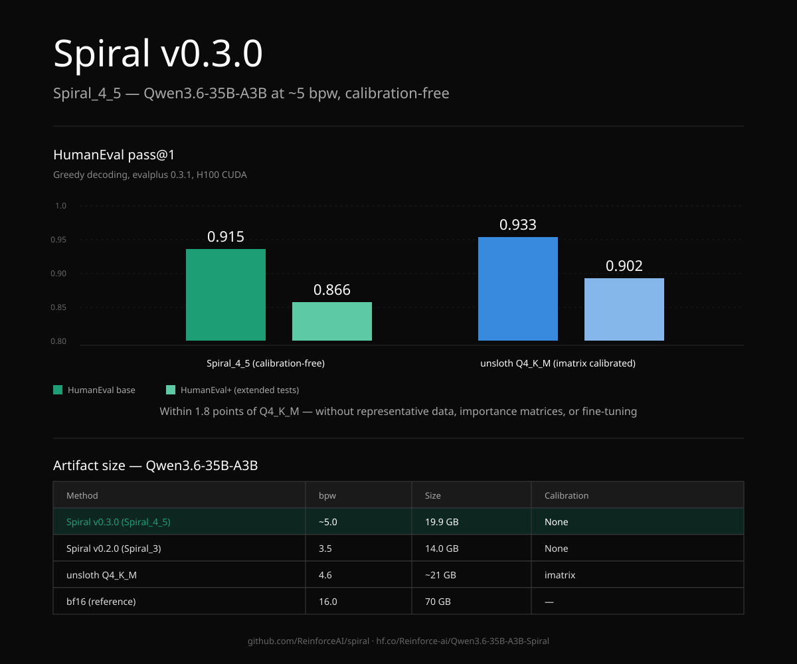

# Spiral

**Geometric compression of rotated transformers.**

Spiral exploits the geometric structure of transformer weights to achieve calibration-free compression competitive with the strongest community quantization schemes (within 1.8pp of unsloth Q4_K_M on HumanEval) — without calibration data, without fine-tuning.

**Latest release: v0.3.0 — Spiral_4_5 (~5.0 bpw).** Production-stable on Apple Silicon (Metal) and NVIDIA H100 (CUDA).

| | Spiral_4_5 | unsloth Q4_K_M |
|---|---|---|
| HumanEval pass@1 | 0.915 | 0.933 |
| bpw | ~5.0 | 4.6 |
| Calibration data required | **No** | Yes |

The 1.8pp gap is the cost of being calibration-free. K-quants require representative data (typically wikitext or similar) to construct importance matrices; Spiral derives its compression analytically from the model's own weights.



---

## 📑 Table of Contents

- [Latest Release: v0.3.0](#latest-release-v030)
- [Quality](#quality)
- [Performance](#performance)
- [Cross-platform validation](#cross-platform-validation)
- [⚡ Install](#-install)
- [🚀 Quick Start](#-quick-start)
- [Available Models](#available-models)
- [Version history](#version-history)
- [Limitations](#limitations)
- [Acknowledgments](#acknowledgments)
- [Citation](#citation)
- [License](#license)

---

## Latest Release: v0.3.0

Spiral v0.3.0 ships the Spiral_4_5 scheme — mixed-bit quantization with dense rotation. It supersedes v0.2.0 (Spiral_3).

| Aspect | v0.2.0 | v0.3.0 (current) |
|---|---|---|
| Average compression | 3.5 bpw | ~5.0 bpw |
| NLL vs bf16 | +0.113 nats | ~0 nats |
| HumanEval pass@1 | not measured | 0.915 base / 0.866 plus |
| Multi-turn on Mac | broken (known bug) | works |
| CUDA support | not shipped | shipped |
| Calibration data | not required | not required |
| Production status | research preview | shippable |

---

## Quality

### HumanEval

Measured on H100 with llama-server + evalplus 0.3.1, greedy decoding, thinking mode disabled:

| Method | bpw | Calibration data | HumanEval base | HumanEval+ |
|---|---|---|---|---|
| **Spiral_4_5** | **~5.0** | **None** | **0.915** | **0.866** |
| unsloth Q4_K_M (reference) | 4.6 | Yes (imatrix) | 0.933* | 0.902* |

\* Q4_K_M reference from [unsloth's community leaderboard submission](https://github.com/evalplus/evalplus/issues/299).

Spiral_4_5 is **1.8 percentage points behind Q4_K_M on base HumanEval, 3.6 points behind on HumanEval+** — without calibration data.

### Perplexity

Cross-method perplexity on wikitext-2-raw-v1 (Qwen3.6-35B-A3B, H100):

| Method | bpw | NLL (nats/token) | Gap vs bf16 |
|---|---|---|---|
| bf16 (reference) | 16.0 | 1.8968 | — |
| unsloth Q8_0 | 8.5 | 1.8962 | −0.0006 |
| unsloth Q4_K_XL | 5.2 | 1.8976 | +0.0008 |
| **Spiral_4_5** | **~5.0** | **≈1.8929** | **≈−0.004** |

Spiral_4_5 is competitive with Q4_K_XL on perplexity.

---

## Performance

### Apple M2 Max (Metal)

| Configuration | Decode | Prefill |
|---|---|---|
| f16 KV + flash attention | ~30 tok/s | ~80 tok/s |

### NVIDIA H100 80GB (CUDA)

| Configuration | Decode | Prefill |
|---|---|---|
| f16 KV + flash attention + CUDA graphs | ~91 tok/s | 100-220 tok/s |

---

## Cross-platform validation

The same artifact (`.gguf` + `.spiralcb`) runs on both Metal (Apple Silicon) and CUDA (NVIDIA H100). Output equivalence has been validated by side-by-side comparison on identical greedy prompts:

- Short prompts: byte-identical outputs across both platforms
- Long generations: semantically equivalent reasoning, with minor token-level drift from fp16 ordering differences in the deep stack

HumanEval is measured on H100 CUDA. Mac inference produces equivalent quality (validated by cross-platform diff) but has not been benchmarked separately on HumanEval; expect within 1-2 percentage points of the H100 number.

---

## ⚡ Install

### Brew (Mac)

```bash
brew install reinforceai/spiral/spiral
```

Installs the Spiral fork of `llama.cpp` plus the wrappers: `spiral-chat`, `spiral-serve`, `spiral-download`.

### Build from source

For CUDA, or to develop against the framework:

```bash
git clone https://github.com/ReinforceAI/spiral
cd spiral

# Apple Silicon (Metal):
cmake -B build -DGGML_METAL=ON
cmake --build build -j

# NVIDIA CUDA (H100, A100, etc.):
cmake -B build -DGGML_CUDA=ON
cmake --build build -j
```

Standard upstream `llama.cpp` does not load Spiral-compressed models.

---

## 🚀 Quick Start

### Interactive chat

```bash
spiral-chat                                    # default model: qwen-25-7b-spiral
spiral-chat --model qwen-36-35b-spiral         # 35B Spiral_4_5
```

First run auto-downloads the GGUF and codebook to `~/.spiral/models/<name>/`. Subsequent runs use the local cache.

### Single prompt (non-interactive)

```bash
spiral-chat --model qwen-36-35b-spiral \
    --prompt "Write a Python function to compute Fibonacci numbers iteratively" \
    --greedy
```

### OpenAI-compatible API server

```bash
spiral-serve --model qwen-36-35b-spiral --port 8080
```

```bash
curl http://localhost:8080/v1/chat/completions \
    -H 'Content-Type: application/json' \
    -d '{
      "messages": [{"role": "user", "content": "Hello"}],
      "chat_template_kwargs": {"enable_thinking": false}
    }'
```

`enable_thinking: false` disables Qwen's thinking-block emission — matches how the HumanEval scores above were measured.

### Manual download

If you'd rather drive `llama.cpp` directly:

```bash
hf download Reinforce-ai/Qwen3.6-35B-A3B-Spiral \
    Qwen3.6-35B-A3B-Spiral_4_5.gguf Qwen3.6-35B-A3B-Spiral_4_5.spiralcb \
    --local-dir ./models/spiral-4-5/
```

```bash
SPIRAL_CODEBOOK_PATH=./models/spiral-4-5/Qwen3.6-35B-A3B-Spiral_4_5.spiralcb \
./build/bin/llama-cli \
    -m ./models/spiral-4-5/Qwen3.6-35B-A3B-Spiral_4_5.gguf \
    -ngl 99 \
    -ctk f16 -ctv f16 -fa on \
    -c 8192 --temp 0 \
    -cnv
```

`SPIRAL_CODEBOOK_PATH` is required for every Spiral inference.

---

## Available Models

| Model | Version | Scheme | Size | Base |
|---|---|---|---|---|
| `qwen-25-7b-spiral` | v0.2.0 | Spiral_3 | 3.0 GB | Qwen2.5-Coder-7B |
| `qwen-36-35b-spiral` | v0.3.0 | Spiral_4_5 | 20.0 GB | Qwen3.6-35B-A3B |

A Spiral_4_5 update for the 7B is on the roadmap.

---

## Version history

### v0.3.0 (current, May 2026) — Spiral_4_5
- Mixed-bit weight compression at ~5.0 bpw average
- HumanEval pass@1 = 0.915 base / 0.866 plus on Qwen3.6-35B-A3B
- CUDA support for NVIDIA H100, A100, RTX (CC ≥ 7.5)
- Multi-turn conversational use stable on both Metal and CUDA
- Calibration-free
- Status: production-grade

### v0.2.0 (April 2026) — Spiral_3
- 3.5 bpw INT3 with KV cache compression (7.1× K compression)
- +0.113 nats vs bf16 on wikitext-2-raw-v1
- Apple Silicon (Metal) only
- **Known issue:** multi-turn conversational mode on Mac produced hallucinated context for some prompts. Workaround: single-prompt mode.
- Status: superseded by v0.3.0. v0.3.0 recommended for new deployments.

---

## Limitations

- **KV cache compression not in this release.** Long-context use cases that would benefit from KV compression are not addressed in v0.3.0; future releases will revisit.
- **HumanEval measured on H100 CUDA only.** Mac HumanEval is expected within 1-2pp by cross-platform diff validation but has not been measured separately.
- **Custom llama.cpp build required.** Stock upstream `llama.cpp` does not load Spiral models.
- **Coding benchmarks only.** HumanEval is the primary capability evaluation in this release.
- **Research-grade release.** APIs may change before 1.0.

---

## Acknowledgments

Spiral builds on open-source foundations:

- **[llama.cpp](https://github.com/ggerganov/llama.cpp)** by Georgi Gerganov — inference engine, GGUF format, Metal and CUDA backends.
- **[unsloth](https://huggingface.co/unsloth)** — high-quality GGUF quantizations of Qwen3.6-35B-A3B and many other models, used as the reference comparison point in this release (Q4_K_M, Q4_K_XL, Q8_0).
- **[TurboQuant](https://github.com/turbo-llm/turbo3)** by Eric Kryski — fused asymmetric attention kernels and tensor-core dispatch patterns.
- **[llama-cpp-turboquant](https://github.com/TheTom/llama-cpp-turboquant)** by TheTom — llama.cpp integration patterns for custom quantization schemes.
- **Qwen Team** — Qwen2.5-Coder, Qwen3.6 under Apache 2.0.
- The broader open-source ML community — researchers contributing to quantization theory, rotation methods, and product quantization laid the groundwork that Spiral builds upon.

This work would not be possible without the remarkable researchers and engineers who contribute to open source.

---

## Citation

```bibtex
@misc{spiral2026,
  title={Spiral: Geometric Compression of Rotated Transformers},
  author={Deshwal, Viraj},
  year={2026},
  publisher={ReinforceAI},
  url={https://github.com/ReinforceAI/spiral}
}
```

## License

- Inference engine: Based on llama.cpp (MIT)
- Spiral compression framework: ReinforceAI
- Model weights: Subject to base model license (Apache 2.0 for Qwen2.5-Coder and Qwen3.6)